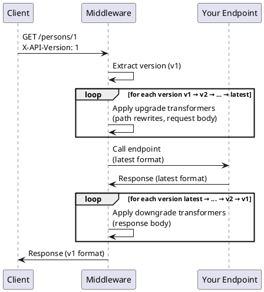
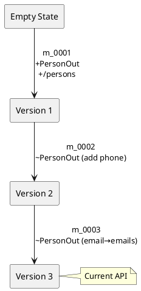

# How It Works

django-ninja-crane enables API versioning through three mechanisms:

1. **Migration files** store schema deltas between versions
1. **State reconstruction** rebuilds the API schema at any historical version
1. **Runtime transformation** converts data between versions on every request

At **Development time**, you use `python manage.py makeapimigrations` to detect differences between the stored
schema deltas and your code. Then, you fill in the generated [migration file](./migration-files.md)'s
transformers (if any), to tell the versioning middleware how to "upgrade" from this version to the latest version.

Then, at **Runtime**, the migration files you made are used when a request for an older version is encountered:



### Step by Step

1. **Version extraction** — The middleware reads `X-API-Version` header or `api_version` query param
2. **Upgrade loop** — For each migration between extracted version and latest, apply upgrade transformers (path
   rewrites, request body transforms)
3. **Endpoint execution** — Your code runs with the latest format, unaware of versioning
4. **Downgrade loop** — For each migration from latest back to extracted version, apply downgrade transformers (response
   body transforms)

## State Reconstruction

Migrations store **deltas**, not full schemas. To get the API schema at version N, we apply all existing deltas:

```
empty → apply(m_0001) → v1 → apply(m_0002) → v2 → apply(m_0003) → v3
```

This allows our `makeapimigrations` command to compare the state resulting from all deltas against the state in your
code.
That difference can _also_ be expressed as a version delta, and is what's saved into the newest migration file.



The state stored in the migration deltas does not cover _all_ possible OpenAPI fields.
To allow you to add examples, auth, ..., the runtime uses deltas backwards: It takes the openapi json currently
generated
by your NinjaAPI, and applies the inverse of each delta to get to the target version.

## Transformation Engine

### Schema Transformers

Schema transformers apply **recursively** wherever a schema appears:

```python
# PersonOut might appear in:
# - Direct response body
# - Nested in TeamOut.leader
# - Items in list[PersonOut]
# - Union types: PersonOut | CompanyOut
```

The engine traverses the response structure and applies the appropriate transformer at each location.

### Transformation Order

For a request from v1 to a v3 API:

```
v1 request → upgrade(m_0002) → upgrade(m_0003) → v3 endpoint
v3 response → downgrade(m_0003) → downgrade(m_0002) → v1 response
```

Migrations are applied in sequence, forwards for upgrades, backwards for downgrades.

This allows each transformer to be written in isolation: it only needs to concern itself how to get a schema from
version n to version n+1, and back.

## Middleware Details

The `VersionedAPIMiddleware`:

1. **Discovers APIs** — Finds all `VersionedNinjaAPI` instances by introspecting URL patterns
2. **Caches migrations** — Loads migrations once, caches API states
3. **Handles async** — Supports both sync and async Django
4. **Preserves headers** — Copies response headers through transformations

### Per-Request State

The middleware attaches version info to the request:

```python
request.api_version  # "1" - the resolved version
request.api_latest_version  # "3" - the current latest
request.original_path  # "/persons/1" - before rewriting (if rewritten)
```

## OpenAPI Generation

The versioned OpenAPI generator:

1. Loads migrations up to the requested version
2. Reconstructs the API state at that version
3. Generates an OpenAPI schema reflecting that state

This means `/api/docs?version=1` shows the API as it was at v1, with old paths, old schemas, and old parameters.

> [!info]- Why Deltas Instead of Full Schemas?
>
> Storing full schemas at each version would be simpler, but result in much larger migration files:
>
> - Most changes are small (add a field, rename an endpoint)
> - Storing the json of each state would also include all the json schema data for _unchanged_ endpoints and schemas.
> - Deltas make diffs obvious and reviewable
>
> The tradeoff is that reconstructing state requires applying all migrations in sequence. This is cached in production,
> so the cost is paid once per process startup.
