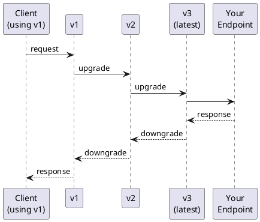

# django-ninja-crane

**Stripe-style API versioning for Django Ninja.**

django-ninja-crane adds versioning and migrations to your Django Ninja APIs.
When you change your API schemas, clients can keep using older versions,
by transforming older api payloads before they reach your view.

## The Problem

You've built an API. Users depend on it. Then you need to make a breaking change:

* restructuring what fields are where in the schema.
* changing the type of a field, e.g., from a string to a list of strings.

Traditionally, you have a few (usually painful) options:

1. Run multiple versions of your application, putting the "old" version in a deprecation track.
1. Make multiple NinjaAPI and/or router instances for each version, resulting in multiple views to maintain.

## The Solution

Stripe already has a [great solution](https://stripe.com/blog/api-versioning) to this problem:

* Your code maintains the latest version of the API
* Changes between API versions are described as migrations in code: how the schemas changed, and how to migrate
  payloads/responses
  between versions.
* API users can stay on "their" preferred version of the API, with the migrations reshaping the request into a request
  of the latest version, and its response back into a response of the user's version.

Django Ninja Crane provides an easy-to-use implementation of this api versioning methodology, for Django apps using
django-ninja.

It does this through:

- **Auto-generated Migration files** track schema changes over time (like Django's database migrations)
- **Automatic transformation** of requests and responses (payloads, path parameters) between versions
- **Versioned OpenAPI docs** with a version selector in Swagger UI
- **Flexible version detection**: built-in through request headers, with the ability to plug-in your own logic.

### In brief

Making a new version in django ninja crane consists of the following steps:

1. You make changes to your API schemas
2. `makeapimigrations` auto-detects how your schemas/endpoints changed between versions and creates an api migration
   file, with "fill-in-the-blank" functions for you to write when breaking data changes are made.
3. You fill in the blanks: writing transformer functions to handle upgrading/downgrading schema/endpoint data between
   versions
4. At runtime, the versioning middleware uses the migration files and their transformation functions to turn a request
   into its shape for the latest version, and the api user receives a response in the shape of their older version.

## Where to Start

**New to django-ninja-crane?** Start with the [Quickstart](get-started/quickstart.md) to get up and running.

**Need configuration details?** See the [Configuration Reference](get-started/configuration.md) for all options.

**Want to understand the design?** Read [How It Works](concepts/how-it-works.md) for the architecture.

## Status

django-ninja-crane is at early stages. The core functionality is complete and tested:

- API state extraction and delta detection
- Migration file generation
- Request/response transformation
- Django middleware integration
- Versioned OpenAPI schema generation

The public "API" (migration file syntax, middleware extension points, ninjaapi wrappng) _should_ remain stable,
but internals like _how_ migration files are generated are still subject to change as the project evolves in supported
features.
